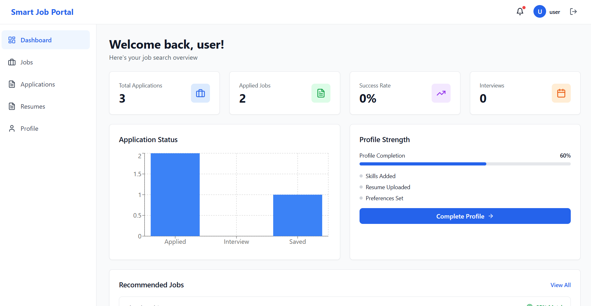

<div align="center">

# 🚀 Smart Job Portal Ecosystem

### Your AI-Powered Career Companion

[](https://choosealicense.com/licenses/mit/)
[](https://nodejs.org/)
[](https://reactjs.org/)
[](https://www.typescriptlang.org/)
[](https://www.sqlite.org/)

A full-stack TypeScript/React job portal application with intelligent job matching, ATS-optimized resume builder, application tracking, and personalized learning roadmaps.

[Features](#-features) • [Getting Started](#-getting-started) • [Tech Stack](#-tech-stack) • [API Docs](#-api-endpoints) • [Contributing](#-contributing)




[](MORE_IMAGES.md)

</div>

---

## ✨ Features

### 🎯 Core Features
- **🔍 Job Discovery Engine**: Browse and search jobs with advanced filters
- **🤖 Smart Job Matching**: AI-powered matching based on skills and profile
- **📄 Resume Builder**: Create ATS-optimized resumes with multiple templates
- **📊 Application Tracker**: Track all applications with status updates and timeline
- **🎓 Learning Roadmap**: Personalized interview prep and skill development paths
- **🔔 Notifications**: Real-time alerts for job matches and application updates
- **📈 Dashboard Analytics**: Visual insights into your job search progress

### 🛠️ Tech Stack

**Frontend:**
- ⚛️ React 18 with TypeScript
- ⚡ Vite for fast development
- 🎨 TailwindCSS for styling
- 🔄 React Query for data fetching
- 🐻 Zustand for state management
- 📝 React Hook Form for forms
- 📊 Recharts for analytics

**Backend:**
- 🟢 Node.js with Express
- 💾 SQLite with Sequelize ORM (no installation needed!)
- 🔐 JWT authentication
- 🌐 RESTful API architecture

## 🚀 Getting Started

### 📋 Prerequisites
- Node.js 18+ 
- npm or yarn
- ✅ No database installation needed! (Uses SQLite)

### 📦 Installation

**1. Clone the repository**
```bash
git clone https://github.com/bikram73/Smart_Job_Portal_Ecosystem.git
cd Smart_Job_Portal_Ecosystem
```

**2. Install dependencies**
```bash
npm run install-all
```

**3. Configure environment variables**

Create `server/.env`:
```env
PORT=5000
JWT_SECRET=your_secret_key_here
CLIENT_URL=http://localhost:3000
```

**4. Run the application**
```bash
npm run dev
```

This will start:
- 🎨 Frontend: http://localhost:3000
- ⚙️ Backend: http://localhost:5000

### 💻 Development Commands

Run frontend only:
```bash
npm run client
```

Run backend only:
```bash
npm run server
```

## 📁 Project Structure

```
Smart_Job_Portal_Ecosystem/
├── 📂 client/                 # React frontend
│   ├── 📂 src/
│   │   ├── 📂 components/    # Reusable components
│   │   ├── 📂 pages/         # Page components
│   │   ├── 📂 services/      # API services
│   │   ├── 📂 store/         # State management
│   │   ├── 📂 types/         # TypeScript types
│   │   └── 📄 App.tsx        # Main app component
│   └── 📄 package.json
├── 📂 server/                # Node.js backend
│   ├── 📂 models/           # Database models
│   ├── 📂 routes/           # API routes
│   ├── 📂 middleware/       # Express middleware
│   ├── 📂 services/         # Business logic
│   └── 📄 server.js         # Server entry point
└── 📄 package.json          # Root package.json
```

## 🔌 API Endpoints

### 🔐 Authentication
- `POST /api/auth/register` - Register new user
- `POST /api/auth/login` - Login user
- `GET /api/auth/profile` - Get user profile

### 💼 Jobs
- `GET /api/jobs` - Get all jobs (with filters)
- `GET /api/jobs/:id` - Get job by ID
- `GET /api/jobs/search` - Search jobs

### 📋 Applications
- `GET /api/applications` - Get user applications
- `POST /api/applications` - Create application
- `PUT /api/applications/:id` - Update application
- `DELETE /api/applications/:id` - Delete application
- `GET /api/applications/stats` - Get application statistics

### 📄 Resumes
- `GET /api/resumes` - Get user resumes
- `GET /api/resumes/:id` - Get resume by ID
- `POST /api/resumes` - Create resume
- `PUT /api/resumes/:id` - Update resume
- `DELETE /api/resumes/:id` - Delete resume
- `POST /api/resumes/analyze` - Analyze resume for ATS score

### 👤 Profile
- `PUT /api/profile` - Update user profile
- `GET /api/profile/matching-jobs` - Get matching jobs

### 🔔 Notifications
- `GET /api/notifications` - Get notifications
- `PUT /api/notifications/:id/read` - Mark as read
- `PUT /api/notifications/read-all` - Mark all as read

### 🎓 Roadmap
- `GET /api/roadmap/:jobId` - Get learning roadmap for job

## 🎯 Features in Detail

### 🔍 Job Discovery
- Search by keywords, location, job type
- Filter by experience level, salary range
- View detailed job descriptions
- See skill match percentage

### 📊 Application Tracking
- Save jobs for later
- Track application status
- Add notes and reminders
- View application timeline
- Identify skill gaps

### 📄 Resume Builder
- Multiple professional templates
- ATS score calculation
- Job-specific optimization
- PDF export
- Real-time preview

### 🎓 Learning Roadmap
- Skill gap analysis
- Personalized learning paths
- Interview preparation guides
- Resource recommendations
- Progress tracking

## 🔮 Future Enhancements

- 🤖 AI Interview Simulator
- 🏢 Employer Portal
- ✨ Resume Auto-Improve AI
- 💰 Salary Prediction
- 🤝 Referral Network System
- 🕷️ Job Scraping Engine (LinkedIn, Naukri, Indeed)
- 📧 Email Notifications
- 📊 Advanced Analytics

## 🤝 Contributing

Contributions are welcome! Please follow these steps:

1. 🍴 Fork the repository
2. 🌿 Create a feature branch (`git checkout -b feature/AmazingFeature`)
3. 💾 Commit your changes (`git commit -m 'Add some AmazingFeature'`)
4. 📤 Push to the branch (`git push origin feature/AmazingFeature`)
5. 🔃 Open a Pull Request

## 📝 License

This project is licensed under the MIT License - see the [LICENSE](LICENSE) file for details.

## 👨‍💻 Author

**Bikram**
- GitHub: [@bikram73](https://github.com/bikram73)

## 🙏 Acknowledgments

- Built with ❤️ using React, Node.js, and TypeScript
- Icons from Lucide React
- UI inspiration from modern job portals

## 📞 Support

For issues and questions, please open an issue on [GitHub Issues](https://github.com/bikram73/Smart_Job_Portal_Ecosystem/issues).

---

<div align="center">

Made with ❤️ by Bikram

⭐ Star this repo if you find it helpful!

</div>
